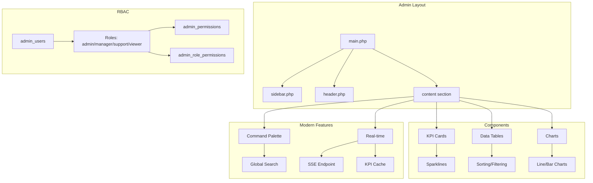

# Admin Dashboard Redesign Plan (2026 Best Practices)

## Executive Summary

This plan outlines a comprehensive redesign of the admin dashboard to align with 2026 best practices, addressing current issues with inconsistent styling, duplicated code, and missing modern features.

---

## 1. Current State Analysis

### Issues Identified

| Issue | Current State | Impact |
|-------|--------------|--------|
| **Styling Inconsistency** | Mix of custom CSS + Bootstrap 5 | Visual fragmentation |
| **No Layout Template** | Each page duplicates sidebar | Code duplication, maintenance burden |
| **Basic Visualizations** | Simple line charts with Chart.js | Limited analytics |
| **No Dark Mode** | Light-themed only | Poor developer/admin experience |
| **No Command Palette** | Manual navigation required | Slow workflows |
| **Static Data** | Page reload for updates | Stale information |

### Existing Database Schema

```sql
-- admin_users table (already exists)
admin_users (
    id, username, password_hash, email, full_name,
    role ENUM('admin','manager','support'),
    created_at, last_login
)

-- admin_activity_logs (already exists)
admin_activity_logs (
    id, admin_id, action, target_type, target_id,
    details, ip_address, created_at
)
```

---

## 2. Proposed Architecture

### New Folder Structure

```
admin/
├── layout/
│   ├── main.php              # Common admin layout wrapper
│   ├── sidebar.php           # Collapsible navigation
│   ├── header.php            # Top navbar with search/notifications
│   └── footer.php            # Footer with scripts
├── components/
│   ├── cards/
│   │   ├── kpi-card.php      # Metric cards with sparklines
│   │   └── stat-card.php     # Simple stat display
│   ├── charts/
│   │   ├── line-chart.php    # Trend visualization
│   │   ├── bar-chart.php     # Comparison charts
│   │   └── sparkline.php     # Mini inline charts
│   ├── tables/
│   │   ├── data-table.php     # Advanced grid with sorting/filtering
│   │   └── table-row.php      # Reusable row component
│   ├── forms/
│   │   ├── search-input.php  # Global search
│   │   └── filter-dropdown.php
│   └── ui/
│       ├── badge.php         # Status badges
│       ├── button.php        # Styled buttons
│       └── modal.php         # Reusable modal
├── assets/
│   ├── css/
│   │   ├── admin.css         # Main admin styles
│   │   ├── admin-dark.css    # Dark theme overrides
│   │   ├── components.css    # Component styles
│   │   └── variables.css     # CSS custom properties
│   └── js/
│       ├── admin.js          # Core admin functionality
│       ├── charts.js         # Chart configurations
│       ├── tables.js         # Data table logic
│       ├── command-palette.js # Cmd+K functionality
│       └── realtime.js       # WebSocket/SSE handlers
├── pages/
│   ├── dashboard.php         # Main dashboard (existing, will refactor)
│   ├── users/list.php        # (existing - will use new layout)
│   ├── orders/list.php       # (existing - will use new layout)
│   └── [other pages...]
├── api/
│   └── realtime.php          # SSE endpoint for live updates
└── templates/
    └── error.php             # Error page template
```

### Common Layout File Structure

**Primary Layout: `admin/layout/main.php`**

```php
<?php
// admin/layout/main.php
require_once __DIR__ . '/../../src/config.php';
require_once __DIR__ . '/../../src/admin-auth.php';

$currentPage = $_GET['page'] ?? 'dashboard';
$adminUser = getCurrentAdmin();

function render(string $title, callable $content): void {
    global $adminUser, $currentPage;
?>
<!DOCTYPE html>
<html lang="en" data-theme="dark">
<head>
    <meta charset="UTF-8">
    <meta name="viewport" content="width=device-width, initial-scale=1.0">
    <title><?= htmlspecialchars($title) ?> - <?= APP_NAME ?> Admin</title>
    
    <!-- Fonts -->
    <link rel="preconnect" href="https://fonts.googleapis.com">
    <link href="https://fonts.googleapis.com/css2?family=Plus+Jakarta+Sans:wght@400;500;600;700&family=Geist+Mono:wght@400;500&display=swap" rel="stylesheet">
    
    <!-- Bootstrap 5 -->
    <link href="https://cdn.jsdelivr.net/npm/bootstrap@5.3.3/dist/css/bootstrap.min.css" rel="stylesheet">
    
    <!-- Custom Admin CSS -->
    <link href="../assets/css/variables.css" rel="stylesheet">
    <link href="../assets/css/admin.css" rel="stylesheet">
    <link href="../assets/css/components.css" rel="stylesheet">
    
    <!-- Icons -->
    <link rel="stylesheet" href="https://cdnjs.cloudflare.com/ajax/libs/font-awesome/6.4.0/css/all.min.css">
</head>
<body>
    <div class="admin-wrapper">
        <?php include __DIR__ . '/sidebar.php'; ?>
        
        <div class="admin-main">
            <?php include __DIR__ . '/header.php'; ?>
            
            <main class="admin-content">
                <?php $content(); ?>
            </main>
        </div>
    </div>
    
    <!-- Command Palette -->
    <div id="command-palette" class="command-palette hidden">
        <div class="command-palette-backdrop"></div>
        <div class="command-palette-modal">
            <input type="text" id="cmd-search" placeholder="Search pages, users, orders..." autocomplete="off">
            <div id="cmd-results"></div>
        </div>
    </div>
    
    <!-- Scripts -->
    <script src="https://cdn.jsdelivr.net/npm/bootstrap@5.3.3/dist/js/bootstrap.bundle.min.js"></script>
    <script src="https://cdn.jsdelivr.net/npm/chart.js"></script>
    <script src="../assets/js/admin.js"></script>
    <script src="../assets/js/command-palette.js"></script>
    <script src="../assets/js/realtime.js"></script>
</body>
</html>
<?php } ?>
```

---

## 3. CSS Architecture

### CSS Variables (Theme System)

**`admin/assets/css/variables.css`**

```css
:root {
    /* ─────────────────────────────────────────────
       TRUE DARK THEME (Default)
       ───────────────────────────────────────────── */
    --bg-primary: #0a0a0f;          /* Deep black */
    --bg-secondary: #12121a;        /* Card backgrounds */
    --bg-tertiary: #1a1a24;         /* Elevated surfaces */
    --bg-hover: #22222e;            /* Hover states */
    
    /* Text Colors */
    --text-primary: #f0f0f5;        /* Main text */
    --text-secondary: #8888a0;      /* Muted text */
    --text-tertiary: #5a5a70;       /* Disabled/placeholder */
    
    /* Accent Colors (Use sparingly) */
    --accent-primary: #6366f1;      /* Indigo - primary actions */
    --accent-hover: #818cf8;        /* Lighter accent */
    
    /* Status Colors (Semantic) */
    --color-success: #10b981;       /* Green - success/positive */
    --color-warning: #f59e0b;       /* Amber - warnings */
    --color-error: #ef4444;         /* Red - errors/alerts */
    --color-info: #3b82f6;          /* Blue - informational */
    
    /* Borders */
    --border-color: #2a2a3a;
    --border-light: #3a3a4a;
    
    /* ─────────────────────────────────────────────
       NEUMORPHIC SOFT UI
       ───────────────────────────────────────────── */
    --neu-shadow-dark: -4px -4px 8px rgba(255,255,255,0.03),
                       4px 4px 12px rgba(0,0,0,0.5);
    --neu-shadow-light: -2px -2px 4px rgba(255,255,255,0.05),
                        2px 2px 6px rgba(0,0,0,0.3);
    --neu-shadow-inset: inset 2px 2px 4px rgba(0,0,0,0.3),
                        inset -2px -2px 4px rgba(255,255,255,0.03);
    
    /* ─────────────────────────────────────────────
       TYPOGRAPHY
       ───────────────────────────────────────────── */
    --font-ui: 'Plus Jakarta Sans', -apple-system, BlinkMacSystemFont, sans-serif;
    --font-mono: 'Geist Mono', 'Fira Code', monospace;
    
    /* Font Sizes */
    --text-xs: 0.75rem;    /* 12px */
    --text-sm: 0.875rem;   /* 14px */
    --text-base: 1rem;     /* 16px */
    --text-lg: 1.125rem;   /* 18px */
    --text-xl: 1.25rem;    /* 20px */
    --text-2xl: 1.5rem;    /* 24px */
    --text-3xl: 1.875rem;  /* 30px */
    
    /* ─────────────────────────────────────────────
       LAYOUT
       ───────────────────────────────────────────── */
    --sidebar-width: 260px;
    --sidebar-collapsed: 72px;
    --header-height: 64px;
    --content-padding: 24px;
    
    /* ─────────────────────────────────────────────
       TRANSITIONS
       ───────────────────────────────────────────── */
    --transition-fast: 150ms ease;
    --transition-base: 250ms ease;
    --transition-slow: 350ms ease;
}

/* Light Theme Override (Optional) */
[data-theme="light"] {
    --bg-primary: #f8f9fa;
    --bg-secondary: #ffffff;
    --bg-tertiary: #f0f0f5;
    --bg-hover: #e8e8ec;
    --text-primary: #1a1a2e;
    --text-secondary: #5a5a70;
    --border-color: #e0e0e8;
    --neu-shadow-dark: -4px -4px 8px rgba(0,0,0,0.05),
                       4px 4px 12px rgba(0,0,0,0.1);
    --neu-shadow-light: none;
}
```

### Main Admin Styles

**`admin/assets/css/admin.css`**

```css
/* Admin Layout */
.admin-wrapper {
    display: flex;
    min-height: 100vh;
    background: var(--bg-primary);
}

/* Sidebar */
.admin-sidebar {
    width: var(--sidebar-width);
    height: 100vh;
    position: fixed;
    left: 0;
    top: 0;
    background: var(--bg-secondary);
    border-right: 1px solid var(--border-color);
    display: flex;
    flex-direction: column;
    transition: width var(--transition-base);
    z-index: 100;
}

.admin-sidebar.collapsed {
    width: var(--sidebar-collapsed);
}

/* Main Content Area */
.admin-main {
    flex: 1;
    margin-left: var(--sidebar-width);
    transition: margin-left var(--transition-base);
}

.admin-sidebar.collapsed + .admin-main {
    margin-left: var(--sidebar-collapsed);
}

/* Sticky Header */
.admin-header {
    position: sticky;
    top: 0;
    height: var(--header-height);
    background: rgba(10, 10, 15, 0.85);
    backdrop-filter: blur(12px);
    border-bottom: 1px solid var(--border-color);
    display: flex;
    align-items: center;
    justify-content: space-between;
    padding: 0 var(--content-padding);
    z-index: 50;
}

/* Main Content */
.admin-content {
    padding: var(--content-padding);
    min-height: calc(100vh - var(--header-height));
}

/* Neumorphic Cards */
.neu-card {
    background: var(--bg-secondary);
    border-radius: 16px;
    box-shadow: var(--neu-shadow-dark);
    padding: 20px;
    transition: transform var(--transition-fast), box-shadow var(--transition-fast);
}

.neu-card:hover {
    transform: translateY(-2px);
    box-shadow: var(--neu-shadow-light), 0 8px 24px rgba(0,0,0,0.3);
}

/* Status Colors - Use as accent only */
.status-success { color: var(--color-success); }
.status-warning { color: var(--color-warning); }
.status-error { color: var(--color-error); }
.status-info { color: var(--color-info); }

/* Responsive */
@media (max-width: 768px) {
    .admin-sidebar {
        transform: translateX(-100%);
    }
    .admin-sidebar.mobile-open {
        transform: translateX(0);
    }
    .admin-main {
        margin-left: 0;
    }
}
```

---

## 4. Component Breakdown

### 4.1 Sidebar Component

**`admin/layout/sidebar.php`**

```php
<aside class="admin-sidebar" id="admin-sidebar">
    <div class="sidebar-header">
        <a href="dashboard.php" class="brand">
            <i class="fas fa-microchip"></i>
            <span class="brand-text"><?= APP_NAME ?></span>
        </a>
        <button class="sidebar-toggle" onclick="toggleSidebar()">
            <i class="fas fa-bars"></i>
        </button>
    </div>
    
    <nav class="sidebar-nav">
        <!-- Dashboard Group -->
        <div class="nav-group">
            <span class="nav-group-title">Overview</span>
            <a href="dashboard.php" class="nav-item <?= $currentPage === 'dashboard' ?>">
                <i class="fas fa-th-large"></i>
                <span>Dashboard</span>
            </a>
        </div>
        
        <!-- Management Group -->
        <div class="nav-group">
            <span class="nav-group-title">Management</span>
            <?php if (canAccess('products')): ?>
            <a href="products/list.php" class="nav-item">
                <i class="fas fa-box"></i>
                <span>Products</span>
            </a>
            <?php endif; ?>
            
            <?php if (canAccess('services')): ?>
            <a href="services/list.php" class="nav-item">
                <i class="fas fa-tools"></i>
                <span>Services</span>
            </a>
            <?php endif; ?>
            
            <?php if (canAccess('orders')): ?>
            <a href="orders/list.php" class="nav-item">
                <i class="fas fa-shopping-cart"></i>
                <span>Orders</span>
                <?php if ($pendingCount > 0): ?>
                <span class="badge badge-warning"><?= $pendingCount ?></span>
                <?php endif; ?>
            </a>
            <?php endif; ?>
            
            <?php if (canAccess('users')): ?>
            <a href="users/list.php" class="nav-item">
                <i class="fas fa-users"></i>
                <span>Users</span>
            </a>
            <?php endif; ?>
        </div>
        
        <!-- Settings Group -->
        <div class="nav-group">
            <span class="nav-group-title">Settings</span>
            <?php if (canAccess('settings')): ?>
            <a href="settings/general.php" class="nav-item">
                <i class="fas fa-cog"></i>
                <span>Settings</span>
            </a>
            <?php endif; ?>
        </div>
    </nav>
    
    <div class="sidebar-footer">
        <div class="admin-user">
            " alt="Profile" class="avatar">
            <div class="user-info">
                <span class="user-name"><?= htmlspecialchars($adminUser['full_name']) ?></span>
                <span class="user-role"><?= ucfirst($adminUser['role']) ?></span>
            </div>
        </div>
    </div>
</aside>
```

### 4.2 Header Component

**`admin/layout/header.php`**

```php
<header class="admin-header">
    <div class="header-left">
        <button class="mobile-menu-btn d-lg-none" onclick="toggleMobileSidebar()">
            <i class="fas fa-bars"></i>
        </button>
        
        <!-- Search Bar -->
        <div class="search-wrapper">
            <i class="fas fa-search"></i>
            <input type="text" placeholder="Search..." class="search-input" id="global-search">
            <kbd>⌘K</kbd>
        </div>
    </div>
    
    <div class="header-right">
        <!-- Quick Actions -->
        <div class="header-actions">
            <a href="products/add.php" class="btn btn-primary btn-sm">
                <i class="fas fa-plus"></i>
                <span>Add New</span>
            </a>
        </div>
        
        <!-- Notifications -->
        <div class="dropdown notifications-dropdown">
            <button class="icon-btn" data-bs-toggle="dropdown">
                <i class="fas fa-bell"></i>
                <?php if ($unreadCount > 0): ?>
                <span class="notification-badge"><?= $unreadCount ?></span>
                <?php endif; ?>
            </button>
            <div class="dropdown-menu dropdown-menu-end notifications-menu">
                <div class="dropdown-header">
                    <span>Notifications</span>
                    <a href="notifications/mark-all-read.php">Mark all read</a>
                </div>
                <div class="notifications-list">
                    <?php foreach ($notifications as $notif): ?>
                    <a href="<?= $notif['link'] ?>" class="notification-item <?= !$notif['read'] ? 'unread' : '' ?>">
                        <div class="notification-icon <?= $notif['type'] ?>">
                            <i class="fas fa-<?= $notif['icon'] ?>"></i>
                        </div>
                        <div class="notification-content">
                            <p><?= htmlspecialchars($notif['message']) ?></p>
                            <span class="notification-time"><?= timeAgo($notif['created_at']) ?></span>
                        </div>
                    </a>
                    <?php endforeach; ?>
                </div>
            </div>
        </div>
        
        <!-- User Profile Dropdown -->
        <div class="dropdown profile-dropdown">
            <button class="profile-btn" data-bs-toggle="dropdown">
                " alt="Profile" class="avatar-sm">
                <span class="d-none d-md-inline"><?= htmlspecialchars($adminUser['full_name']) ?></span>
                <i class="fas fa-chevron-down"></i>
            </button>
            <div class="dropdown-menu dropdown-menu-end">
                <a href="profile.php" class="dropdown-item">
                    <i class="fas fa-user"></i> Profile
                </a>
                <a href="settings/profile.php" class="dropdown-item">
                    <i class="fas fa-cog"></i> Settings
                </a>
                <hr class="dropdown-divider">
                <a href="logout.php" class="dropdown-item text-danger">
                    <i class="fas fa-sign-out-alt"></i> Logout
                </a>
            </div>
        </div>
    </div>
</header>
```

### 4.3 KPI Card Component

**`admin/components/cards/kpi-card.php`**

```php
<?php
function renderKPICard(string $title, $value, $change, string $icon, string $format = 'number'): void {
    $isPositive = $change >= 0;
    $changeClass = $isPositive ? 'positive' : 'negative';
    $changeIcon = $isPositive ? 'arrow-up' : 'arrow-down';
    
    $formattedValue = match($format) {
        'currency' => 'KES ' . number_format($value),
        'percent' => number_format($value, 1) . '%',
        default => number_format($value)
    };
?>
<div class="kpi-card neu-card">
    <div class="kpi-header">
        <div class="kpi-icon">
            <i class="fas fa-<?= $icon ?>"></i>
        </div>
        <div class="kpi-sparkline">
            <canvas id="sparkline-<?= strtolower(str_replace(' ', '-', $title)) ?>" width="80" height="32"></canvas>
        </div>
    </div>
    
    <div class="kpi-body">
        <span class="kpi-value"><?= $formattedValue ?></span>
        <span class="kpi-title"><?= $title ?></span>
    </div>
    
    <div class="kpi-footer">
        <span class="kpi-change <?= $changeClass ?>">
            <i class="fas fa-<?= $changeIcon ?>"></i>
            <?= number_format(abs($change), 1) ?>%
        </span>
        <span class="kpi-period">vs last week</span>
    </div>
</div>

<script>
// Render sparkline
new Chart(document.getElementById('sparkline-<?= strtolower(str_replace(' ', '-', $title)) ?>'), {
    type: 'line',
    data: {
        labels: ['', '', '', '', '', '', ''],
        datasets: [{
            data: [<?= implode(',', generateSparklineData($change)) ?>],
            borderColor: '<?= $isPositive ? '#10b981' : '#ef4444' ?>',
            borderWidth: 2,
            fill: true,
            backgroundColor: '<?= $isPositive ? 'rgba(16,185,129,0.1)' : 'rgba(239,68,68,0.1)' ?>',
            tension: 0.4,
            pointRadius: 0
        }]
    },
    options: {
        plugins: { legend: { display: false } },
        scales: { x: { display: false }, y: { display: false } }
    }
});
</script>
<?php } ?>
```

### 4.4 Data Table Component

**`admin/components/tables/data-table.php`**

```php
<?php
function renderDataTable(array $config): void {
    $columns = $config['columns'];
    $data = $config['data'];
    $actions = $config['actions'] ?? true;
?>
<div class="data-table-wrapper">
    <div class="table-controls">
        <div class="table-search">
            <i class="fas fa-search"></i>
            <input type="text" placeholder="Search..." data-table-search>
        </div>
        
        <div class="table-filters">
            <?php foreach ($config['filters'] ?? [] as $filter): ?>
            <select class="filter-select" data-filter="<?= $filter['column'] ?>">
                <option value=""><?= $filter['label'] ?></option>
                <?php foreach ($filter['options'] as $option): ?>
                <option value="<?= $option['value'] ?>"><?= $option['label'] ?></option>
                <?php endforeach; ?>
            </select>
            <?php endforeach; ?>
        </div>
        
        <div class="table-actions">
            <button class="btn btn-sm btn-outline" data-bulk-action>
                <i class="fas fa-check-square"></i> Bulk Action
            </button>
            <button class="btn btn-sm btn-outline" data-export>
                <i class="fas fa-download"></i> Export
            </button>
        </div>
    </div>
    
    <div class="table-responsive">
        <table class="data-table" id="<?= $config['id'] ?>">
            <thead>
                <tr>
                    <th class="th-checkbox">
                        <input type="checkbox" data-select-all>
                    </th>
                    <?php foreach ($columns as $col): ?>
                    <th data-column="<?= $col['key'] ?>" data-sortable="<?= $col['sortable'] ?? true ?>">
                        <?= $col['label'] ?>
                        <?php if ($col['sortable'] ?? true): ?>
                        <i class="fas fa-sort sort-icon"></i>
                        <?php endif; ?>
                    </th>
                    <?php endforeach; ?>
                    <?php if ($actions): ?>
                    <th>Actions</th>
                    <?php endif; ?>
                </tr>
            </thead>
            <tbody>
                <?php foreach ($data as $row): ?>
                <tr data-row-id="<?= $row[$config['rowKey']] ?>">
                    <td><input type="checkbox" data-row-select value="<?= $row[$config['rowKey']] ?>"></td>
                    <?php foreach ($columns as $col): ?>
                    <td><?= renderCell($row, $col) ?></td>
                    <?php endforeach; ?>
                    <?php if ($actions): ?>
                    <td class="actions-cell">
                        <?= renderRowActions($row, $config['rowActions'] ?? []) ?>
                    </td>
                    <?php endif; ?>
                </tr>
                <?php endforeach; ?>
            </tbody>
        </table>
    </div>
    
    <div class="table-pagination">
        <div class="pagination-info">
            Showing <?= $config['showingStart'] ?? 1 ?> to <?= $config['showingEnd'] ?? count($data) ?> 
            of <?= $config['totalRecords'] ?? count($data) ?> entries
        </div>
        <nav class="pagination">
            <button class="page-btn" disabled>Previous</button>
            <button class="page-btn active">1</button>
            <button class="page-btn">2</button>
            <button class="page-btn">3</button>
            <button class="page-btn">Next</button>
        </nav>
    </div>
</div>
<?php } ?>
```

### 4.5 Command Palette

**`admin/assets/js/command-palette.js`**

```javascript
class CommandPalette {
    constructor() {
        this.isOpen = false;
        this.searchInput = document.getElementById('cmd-search');
        this.resultsContainer = document.getElementById('cmd-results');
        this.items = this.loadItems();
        
        this.init();
    }
    
    loadItems() {
        return [
            // Pages
            { type: 'page', title: 'Dashboard', icon: 'th-large', url: 'dashboard.php', category: 'Pages' },
            { type: 'page', title: 'Products', icon: 'box', url: 'products/list.php', category: 'Pages' },
            { type: 'page', title: 'Orders', icon: 'shopping-cart', url: 'orders/list.php', category: 'Pages' },
            { type: 'page', title: 'Users', icon: 'users', url: 'users/list.php', category: 'Pages' },
            // Actions
            { type: 'action', title: 'Add New Product', icon: 'plus', action: 'products/add.php', category: 'Actions' },
            { type: 'action', title: 'Create Order', icon: 'cart-plus', action: 'orders/create.php', category: 'Actions' },
            // Recent
            { type: 'recent', title: 'Order #1234', icon: 'hashtag', url: 'orders/view.php?id=1234', category: 'Recent' }
        ];
    }
    
    init() {
        // Keyboard shortcut
        document.addEventListener('keydown', (e) => {
            if ((e.metaKey || e.ctrlKey) && e.key === 'k') {
                e.preventDefault();
                this.toggle();
            }
            if (e.key === 'Escape') {
                this.close();
            }
        });
        
        // Click backdrop to close
        document.querySelector('.command-palette-backdrop')?.addEventListener('click', () => this.close());
        
        // Search input
        this.searchInput?.addEventListener('input', (e) => this.search(e.target.value));
    }
    
    toggle() {
        this.isOpen = !this.isOpen;
        const palette = document.getElementById('command-palette');
        palette?.classList.toggle('hidden', !this.isOpen);
        
        if (this.isOpen) {
            this.searchInput?.focus();
            this.renderItems(this.items);
        }
    }
    
    close() {
        this.isOpen = false;
        document.getElementById('command-palette')?.classList.add('hidden');
    }
    
    search(query) {
        if (!query) {
            this.renderItems(this.items);
            return;
        }
        
        const results = this.items.filter(item => 
            item.title.toLowerCase().includes(query.toLowerCase()) ||
            item.category.toLowerCase().includes(query.toLowerCase())
        );
        
        this.renderItems(results);
    }
    
    renderItems(items) {
        if (!this.resultsContainer) return;
        
        const grouped = items.reduce((acc, item) => {
            if (!acc[item.category]) acc[item.category] = [];
            acc[item.category].push(item);
            return acc;
        }, {});
        
        this.resultsContainer.innerHTML = Object.entries(grouped).map(([category, items]) => `
            <div class="cmd-group">
                <div class="cmd-group-title">${category}</div>
                ${items.map(item => `
                    <div class="cmd-item" data-type="${item.type}" data-url="${item.url || ''}" data-action="${item.action || ''}">
                        <i class="fas fa-${item.icon}"></i>
                        <span>${item.title}</span>
                    </div>
                `).join('')}
            </div>
        `).join('');
        
        // Add click handlers
        this.resultsContainer.querySelectorAll('.cmd-item').forEach(item => {
            item.addEventListener('click', () => this.executeItem(item.dataset));
        });
    }
    
    executeItem(dataset) {
        if (dataset.url) {
            window.location.href = dataset.url;
        } else if (dataset.action) {
            // Execute action
            eval(dataset.action);
        }
        this.close();
    }
}

document.addEventListener('DOMContentLoaded', () => {
    window.cmdPalette = new CommandPalette();
});
```

---

## 5. Database Schema Changes

### New Tables Required

```sql
-- admin_permissions - RBAC permissions
CREATE TABLE IF NOT EXISTS admin_permissions (
    id INT UNSIGNED AUTO_INCREMENT PRIMARY KEY,
    name VARCHAR(50) NOT NULL UNIQUE,
    description VARCHAR(255),
    created_at TIMESTAMP DEFAULT CURRENT_TIMESTAMP
);

-- admin_role_permissions - Role to permission mapping
CREATE TABLE IF NOT EXISTS admin_role_permissions (
    role ENUM('admin', 'manager', 'support', 'viewer') NOT NULL,
    permission_id INT UNSIGNED NOT NULL,
    PRIMARY KEY (role, permission_id),
    FOREIGN KEY (permission_id) REFERENCES admin_permissions(id) ON DELETE CASCADE
);

-- admin_notifications - In-app notifications
CREATE TABLE IF NOT EXISTS admin_notifications (
    id BIGINT UNSIGNED AUTO_INCREMENT PRIMARY KEY,
    admin_id INT UNSIGNED NOT NULL,
    type ENUM('order', 'product', 'user', 'system') NOT NULL,
    title VARCHAR(100) NOT NULL,
    message TEXT NOT NULL,
    link VARCHAR(255),
    is_read TINYINT(1) DEFAULT 0,
    created_at TIMESTAMP DEFAULT CURRENT_TIMESTAMP,
    FOREIGN KEY (admin_id) REFERENCES admin_users(id) ON DELETE CASCADE,
    INDEX idx_admin_id_read (admin_id, is_read),
    INDEX idx_created_at (created_at)
);

-- Real-time KPI cache for live updates
CREATE TABLE IF NOT EXISTS kpi_cache (
    id INT UNSIGNED AUTO_INCREMENT PRIMARY KEY,
    metric_key VARCHAR(50) NOT NULL UNIQUE,
    metric_value DECIMAL(15,2) NOT NULL,
    previous_value DECIMAL(15,2),
    change_percent DECIMAL(6,2),
    updated_at TIMESTAMP DEFAULT CURRENT_TIMESTAMP ON UPDATE CURRENT_TIMESTAMP
);
```

### Updated admin_users Schema

```sql
ALTER TABLE admin_users 
ADD COLUMN IF NOT EXISTS avatar VARCHAR(255),
ADD COLUMN IF NOT EXISTS preferences JSON,
ADD COLUMN IF NOT EXISTS last_activity TIMESTAMP NULL,
ADD COLUMN IF NOT EXISTS is_online TINYINT(1) DEFAULT 0;
```

---

## 6. API Endpoints for Real-time Data

### Server-Sent Events (SSE) Endpoint

**`admin/api/realtime.php`**

```php
<?php
// admin/api/realtime.php
session_start();
require_once __DIR__ . '/../../src/config.php';
require_once __DIR__ . '/../../src/admin-auth.php';

header('Content-Type: text/event-stream');
header('Cache-Control: no-cache');
header('Connection: keep-alive');

// Prevent buffering
@ini_set('output_buffering', 0);
@ini_set('implicit_flush', 1);

$lastEventId = $_SERVER['LAST_EVENT_ID'] ?? 0;

while (true) {
    // Check for new KPI data
    $kpiData = fetchOne("
        SELECT metric_key, metric_value, change_percent, updated_at 
        FROM kpi_cache 
        WHERE updated_at > DATE_SUB(NOW(), INTERVAL 5 SECOND)
    ");
    
    if ($kpiData) {
        $eventData = json_encode([
            'type' => 'kpi_update',
            'data' => $kpiData,
            'timestamp' => time()
        ]);
        
        echo "id: " . (++$lastEventId) . "\n";
        echo "event: kpi\n";
        echo "data: {$eventData}\n\n";
    }
    
    // Check for new notifications
    $unreadCount = fetchOne("
        SELECT COUNT(*) as cnt FROM admin_notifications 
        WHERE admin_id = ? AND is_read = 0
    ", [$_SESSION['admin_user']['id']]);
    
    if ($unreadCount && $unreadCount['cnt'] > 0) {
        $eventData = json_encode([
            'type' => 'notification',
            'count' => $unreadCount['cnt']
        ]);
        
        echo "id: " . (++$lastEventId) . "\n";
        echo "event: notification\n";
        echo "data: {$eventData}\n\n";
    }
    
    // Flush output
    if (ob_get_level()) ob_end_flush();
    flush();
    
    // Sleep before next check
    sleep(2);
    
    // Close connection after 30 seconds (heartbeat)
    if (connection_aborted()) break;
}
```

### KPI Update API

**`admin/api/kpi.php`**

```php
<?php
// admin/api/kpi.php
require_once __DIR__ . '/../../src/config.php';
require_once __DIR__ . '/../../src/admin-auth.php';

header('Content-Type: application/json');

// Only allow AJAX
if ($_SERVER['REQUEST_METHOD'] !== 'POST') {
    http_response_code(405);
    exit(json_encode(['error' => 'Method not allowed']));
}

// Get current KPIs
$today = date('Y-m-d');
$weekAgo = date('Y-m-d', strtotime('-7 days'));
$lastWeek = date('Y-m-d', strtotime('-14 days'));

$metrics = [
    'revenue' => [
        'current' => fetchOne("SELECT COALESCE(SUM(total_amount), 0) as val FROM orders WHERE payment_status = 'paid' AND created_at >= ?", [$weekAgo])['val'] ?? 0,
        'previous' => fetchOne("SELECT COALESCE(SUM(total_amount), 0) as val FROM orders WHERE payment_status = 'paid' AND created_at BETWEEN ? AND ?", [$lastWeek, $weekAgo])['val'] ?? 0
    ],
    'new_users' => [
        'current' => fetchOne("SELECT COUNT(*) as val FROM users WHERE created_at >= ?", [$weekAgo])['val'] ?? 0,
        'previous' => fetchOne("SELECT COUNT(*) as val FROM users WHERE created_at BETWEEN ? AND ?", [$lastWeek, $weekAgo])['val'] ?? 0
    ],
    'orders' => [
        'current' => fetchOne("SELECT COUNT(*) as val FROM orders WHERE created_at >= ?", [$weekAgo])['val'] ?? 0,
        'previous' => fetchOne("SELECT COUNT(*) as val FROM orders WHERE created_at BETWEEN ? AND ?", [$lastWeek, $weekAgo])['val'] ?? 0
    ]
];

// Calculate changes and update cache
foreach ($metrics as $key => $data) {
    $change = $data['previous'] > 0 
        ? (($data['current'] - $data['previous']) / $data['previous']) * 100 
        : ($data['current'] > 0 ? 100 : 0);
    
    query("
        INSERT INTO kpi_cache (metric_key, metric_value, previous_value, change_percent)
        VALUES (?, ?, ?, ?)
        ON DUPLICATE KEY UPDATE metric_value = ?, previous_value = ?, change_percent = ?
    ", [
        $key, $data['current'], $data['previous'], $change,
        $data['current'], $data['previous'], $change
    ]);
}

echo json_encode([
    'success' => true,
    'data' => array_map(fn($m) => [
        'value' => $m['current'],
        'change' => $m['previous'] > 0 
            ? round((($m['current'] - $m['previous']) / $m['previous']) * 100, 1)
            : ($m['current'] > 0 ? 100 : 0)
    ], $metrics)
]);
```

---

## 7. Implementation Priority Order

### Phase 1: Foundation (Week 1-2)

| Priority | Task | Description |
|----------|------|-------------|
| P1 | CSS Architecture | Create variables.css, admin.css with dark theme |
| P1 | Layout Components | Build main.php, sidebar.php, header.php |
| P1 | Database Schema | Add RBAC tables and update admin_users |
| P2 | RBAC System | Implement canAccess() helper, permission checks |

### Phase 2: Core Components (Week 2-3)

| Priority | Task | Description |
|----------|------|-------------|
| P1 | KPI Cards | Build reusable stat cards with sparklines |
| P2 | Charts | Line charts, bar charts, trend visualization |
| P3 | Data Tables | Advanced tables with sorting/filtering |

### Phase 3: Modern Features (Week 3-4)

| Priority | Task | Description |
|----------|------|-------------|
| P1 | Command Palette | Global search (Cmd+K) |
| P2 | Real-time Updates | SSE for live KPI updates |
| P3 | Notifications | In-app notification system |

### Phase 4: Polish (Week 4-5)

| Priority | Task | Description |
|----------|------|-------------|
| P1 | Microinteractions | Hover animations, transitions |
| P2 | Responsive Design | Mobile-first testing |
| P3 | Performance | Optimize queries, lazy loading |

### Phase 5: Migration (Week 5-6)

| Priority | Task | Description |
|----------|------|-------------|
| P1 | Update Pages | Migrate all admin pages to new layout |
| P2 | Testing | Full QA on all admin pages |
| P3 | Documentation | Document new components/APIs |

---

## 8. Mermaid Diagram: Architecture Overview



---

## 9. Summary of Changes

### Files to Create

| File | Purpose |
|------|---------|
| `admin/layout/main.php` | Common admin layout wrapper |
| `admin/layout/sidebar.php` | Collapsible navigation |
| `admin/layout/header.php` | Top navbar with search/notifications |
| `admin/components/cards/kpi-card.php` | Metric cards |
| `admin/components/charts/*.php` | Chart components |
| `admin/components/tables/data-table.php` | Advanced data tables |
| `admin/assets/css/variables.css` | CSS custom properties |
| `admin/assets/css/admin.css` | Main admin styles |
| `admin/assets/js/command-palette.js` | Cmd+K functionality |
| `admin/assets/js/realtime.js` | SSE handler |
| `admin/api/realtime.php` | Real-time data endpoint |
| `admin/api/kpi.php` | KPI calculation API |

### Database Changes

- Add `admin_permissions` table
- Add `admin_role_permissions` table  
- Add `admin_notifications` table
- Add `kpi_cache` table
- Update `admin_users` with avatar, preferences, online status

### Key Benefits

1. **Consistency**: Single layout template eliminates duplication
2. **Maintainability**: Components can be updated in one place
3. **User Experience**: Dark mode, command palette, real-time updates
4. **Security**: RBAC restricts access based on roles
5. **Performance**: Cached KPIs reduce database load
6. **Modern UI**: Neumorphic design, microinteractions, sparklines

---

*Plan created: 2026-03-10*
*Version: 1.0*
