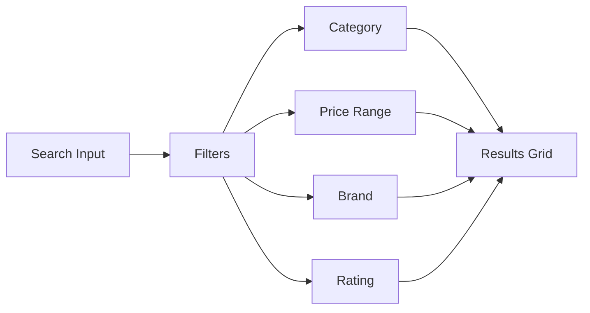

# Final Year Project Improvement Plan

## Project Overview
**Current System:** Outsourced Technologies E-Commerce Platform  
**Type:** Full-featured PHP/MySQL e-commerce with M-Pesa payments  
**Current Status:** Production-ready basic e-commerce with admin panel

---

## Part 1: Current Features Analysis

### ✅ Already Implemented

#### Customer Features
| Feature | Status | Implementation |
|---------|--------|----------------|
| Product Catalog | ✅ Complete | Categories, search, product details |
| Services Booking | ✅ Complete | Booking modal, date/time selection |
| M-Pesa Payment | ✅ Complete | STK Push integration |
| Delivery Zones | ✅ Complete | Distance-based pricing |
| Loyalty Rewards | ✅ Complete | Bronze→Diamond tiers |
| Shopping Cart | ✅ Complete | Session-based |
| User Authentication | ✅ Complete | Registration, login, password reset |
| Order Tracking | ✅ Complete | Live map with driver location |
| Product Reviews | ✅ Complete | Ratings and reviews |
| Chatbot Support | ✅ Complete | AI-powered customer support |

#### Admin Features
| Feature | Status | Implementation |
|---------|--------|----------------|
| Dashboard | ✅ Complete | Sales stats, charts |
| Product Management | ✅ Complete | CRUD operations |
| Service Management | ✅ Complete | CRUD operations |
| Order Management | ✅ Complete | Status updates |
| User Management | ✅ Complete | View/manage users |
| Delivery Zones | ✅ Complete | Zone management |
| Loyalty Tiers | ✅ Complete | Tier configuration |
| System Monitoring | ✅ Complete | Health checks, logs |

#### System Features
| Feature | Status | Implementation |
|---------|--------|----------------|
| Security | ✅ Complete | CSRF, XSS, bcrypt |
| Rate Limiting | ✅ Complete | API protection |
| Activity Logging | ✅ Complete | User actions |
| Email Notifications | ✅ Complete | SMTP support |
| Automated Backups | ✅ Complete | Daily backups |
| Cron Jobs | ✅ Complete | Maintenance tasks |

---

## Part 2: Missing Components

### for Final Year Project 🚨 Critical Gaps

#### 1. Documentation (Required for FYP)
- [ ] **Technical Specification Document**
- [ ] **System Architecture Diagram**
- [ ] **Database ERD (Entity Relationship Diagram)**
- [ ] **Use Case Diagrams**
- [ ] **UML Diagrams** (Class, Sequence, Activity)
- [ ] **Testing Documentation** (Test cases, results)
- [ ] **User Manual**
- [ ] **Admin Manual**

#### 2. Advanced Features

##### Customer Experience
- [ ] **Advanced Product Search/Filter** (price range, brand, specs)
- [ ] **Wishlist/Favorites** functionality
- [ ] **Product Comparison** tool
- [ ] **Recently Viewed Products**
- [ ] **Related Products** recommendations
- [ ] **Social Media Login** (Google, Facebook)
- [ ] **Newsletter Subscription**

##### Business Features
- [ ] **Inventory Management** with low-stock alerts
- [ ] **Return/Refund Management** system
- [ ] **Order Cancellation** with reason tracking
- [ ] **Invoice PDF Generation** (downloadable)
- [ ] **Sales Reports** (daily, weekly, monthly)
- [ ] **Product Categories** management (not just listing)
- [ ] **Featured Products** / Best sellers section

##### Notifications
- [ ] **SMS Notifications** (via Africa's Talking or similar)
- [ ] **Push Notifications** for order updates
- [ ] **WhatsApp Business** integration

#### 3. Technical Improvements

##### API & Architecture
- [ ] **RESTful API Documentation** (Swagger/OpenAPI)
- [ ] **JWT Authentication** (for mobile app support)
- [ ] **WebSocket** for real-time features
- [ ] **API Rate Limiting** improvements
- [ ] **Caching Layer** (Redis or file-based)
- [ ] **Payment Webhook Handling**

##### Security Enhancements
- [ ] **Two-Factor Authentication (2FA)**
- [ ] **Session Management** improvements
- [ ] **Audit Logging** for admin actions
- [ ] **Input Validation** improvements

#### 4. Testing & Quality Assurance
- [ ] **Unit Tests** (PHPUnit)
- [ ] **Integration Tests**
- [ ] **User Acceptance Testing** results
- [ ] **Security Audit** results

---

## Part 3: Recommended Implementation Priority

### Phase 1: Documentation (Do First)
```
1. Create Technical Specification Document
2. Draw System Architecture Diagram
3. Create Database ERD
4. Document Use Cases
```

### Phase 2: High-Impact Features
```
Priority 1:
- Advanced Search & Filters
- Wishlist functionality  
- PDF Invoice Generation
- Inventory alerts

Priority 2:
- Sales Reports
- Product Comparisons
- Newsletter subscription
```

### Phase 3: Technical Excellence
```
- Swagger/OpenAPI documentation
- JWT Authentication
- 2FA implementation
- Caching layer
```

---

## Part 4: Specific Recommendations

### 4.1 Add Advanced Search


**Implementation:**
- Add search history
- Implement autocomplete
- Add filter sidebar on products page
- Sort by: price, popularity, rating, newest

### 4.2 Add Wishlist Feature
```sql
-- New table
CREATE TABLE wishlists (
    id INT PRIMARY KEY AUTO_INCREMENT,
    user_id INT NOT NULL,
    product_id INT NOT NULL,
    created_at TIMESTAMP DEFAULT CURRENT_TIMESTAMP,
    UNIQUE KEY unique_wishlist (user_id, product_id),
    FOREIGN KEY (user_id) REFERENCES users(id),
    FOREIGN KEY (product_id) REFERENCES products(id)
);
```

### 4.3 Add PDF Invoice
```php
// Use TCPDF or FPDF library
// Download at: https://tcpdf.org/
require_once('vendor/tcpdf/tcpdf.php');

function generate_pdf_invoice($order, $user, $items) {
    $pdf = new TCPDF();
    $pdf->AddPage();
    // Add company header
    // Add customer details
    // Add order items table
    // Add totals
    return $pdf->Output('invoice_'.$order['order_number'].'.pdf', 'D');
}
```

### 4.4 Add JWT Authentication
```php
// Add to composer.json
// "firebase/php-jwt": "^6.0"

// Generate JWT token on login
function generate_jwt($user_id, $email) {
    $payload = [
        'user_id' => $user_id,
        'email' => $email,
        'iat' => time(),
        'exp' => time() + 86400 // 24 hours
    ];
    return JWT::encode($payload, JWT_SECRET_KEY, 'HS256');
}
```

### 4.5 Add Swagger Documentation
```php
// Add OpenAPI annotations
/**
 * @OA\Get(
 *     path="/api/v1/products",
 *     summary="List all products",
 *     @OA\Response(response="200", description="Success")
 * )
 */
```

### 4.6 Add Inventory Alerts
```php
// In admin dashboard
function check_low_stock() {
    $low_stock = fetchAll("
        SELECT * FROM products 
        WHERE stock <= reorder_level 
        AND visible = 1
    ");
    
    if (count($low_stock) > 0) {
        // Send alert to admin
        send_low_stock_alert($low_stock);
    }
}
```

---

## Part 5: Project Structure for Documentation

```
final-year-project/
├── docs/
│   ├── 1-introduction.md
│   ├── 2-system-requirements.md
│   ├── 3-system-design.md
│   ├── 4-database-design.md
│   ├── 5-implementation.md
│   ├── 6-testing.md
│   ├── 7-user-manual.md
│   ├── 8-conclusion.md
│   └── references.md
├── diagrams/
│   ├── architecture.png
│   ├── erd.png
│   ├── use-cases.png
│   ├── sequence-login.png
│   └── deployment.png
├── tests/
│   ├── UnitTests.php
│   └── IntegrationTests.php
└── README.md
```

---

## Summary Checklist

### Must Have (Minimum for FYP)
- [ ] Technical Documentation
- [ ] ERD Diagram
- [ ] Use Case Diagrams  
- [ ] Advanced Search
- [ ] Wishlist
- [ ] PDF Invoice
- [ ] Test Cases Document

### Should Have (Good FYP)
- [ ] Sales Reports
- [ ] Inventory Management
- [ ] Swagger API Docs
- [ ] JWT Auth
- [ ] 2FA

### Nice to Have (Excellent FYP)
- [ ] Product Comparison
- [ ] Social Login
- [ ] SMS Notifications
- [ ] Real-time Chat
- [ ] Caching Layer
